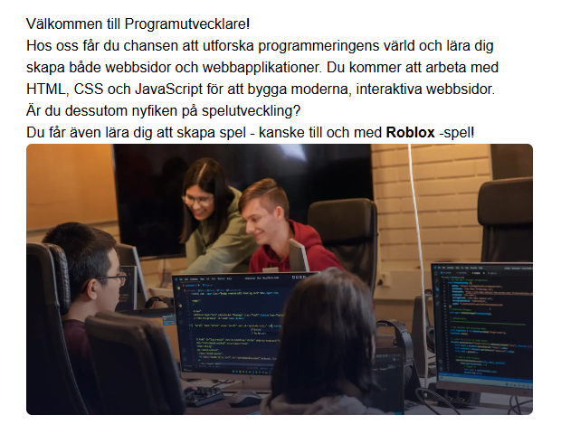
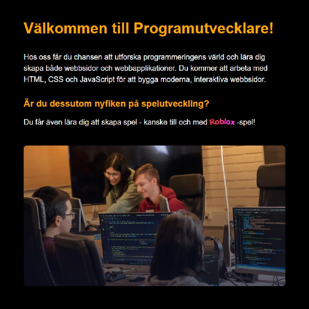

# Programutvecklare Demo Workshop

Ett nybörjarprojekt för att introducera nybörjare till webbutveckling. Repositoryn innehåller två brancher: en ostylad `main`-branch med grundläggande HTML-struktur, och en `completed`-branch som visar den färdiga, stilade versionen med HTML, CSS och JavaScript. Målet med workshoppen är att lära sig ändra koden för att gå från den ostylade till den stilade versionen.

**Ostylad version**

**Den färdiga "stylade" versionen**

